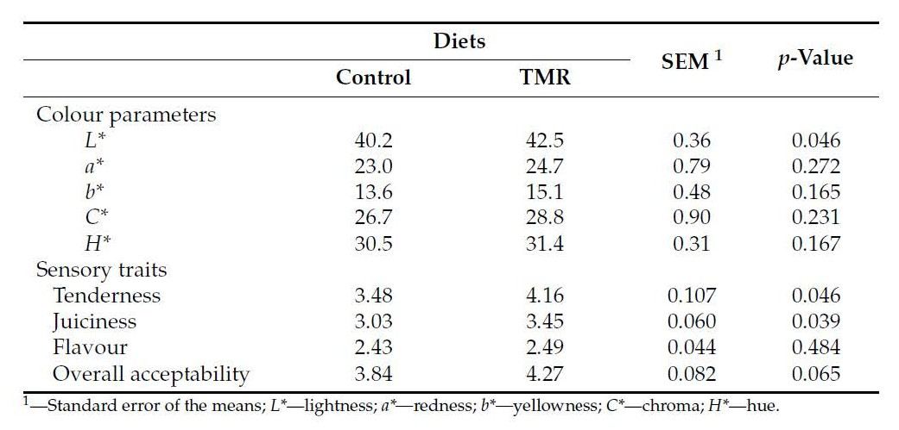

# Introduction

This report evaluates the carbon footprint and the meat color of cattle diets using a data set from Mendeley Data.

The data set originates from a study titled "Effect of a Corn Silage-Based Finishing Diet on Growth, Carcass Composition, Meat Quality, Methane Emissions and Carbon Footprint of Crossbred Angus Young Bulls"

# Data Source

The data set was accessed from Mendeley Data:

Soares, D. M., Bernardino, S., Rodrigues, N., Gama, I., Almeida, J. M., Teixeira, R. F. M., Santos-Silva, J., Alves, S. P., Domingos, T., Martin, C., Marques, G. M., & Bessa, R. J. B. (2025). Data set on growth, carcass composition, meat quality, methane emissions and carbon footprint of crossbred Angus young bulls. \[Data set\]. Mendeley Data. <https://doi.org/10.17632/JCR7ZY93PR>

```{r setup, message= FALSE, warning= FALSE, results='hide', include=FALSE}

library (readxl)
library(httr)


url <- "https://github.com/EmaleeFriend/Group-Project/raw/refs/heads/main/Dataset%20Mendeley%20of%20effect%20of%20a%20corn%20silage%20based%20diet.xlsx"

GET(url, write_disk("data.xlsx", overwrite = TRUE))
dr <- read_excel("data.xlsx")
```

# Data Cleaning

The data set required several pre-processing steps:

-   Column names were standardized using 'janitor'

-   Variables were renamed for clarity and consistency

-   A new variable 'calculated_total_feed' was created

-   Data was reshaped from wide to long format for visualization

These steps ensured compatibility with tidyverse workflows and improved interpretability.

```{r include=FALSE}
library(dplyr)
library(tidyr)
library(ggplot2)
library(janitor)

cfp <-read_excel ("data.xlsx", sheet = "Carbon Footprint", skip = 1) %>%
  clean_names()

meat_color <-read_excel("data.xlsx", sheet = "Meat color")

names(cfp)

cfp <-cfp %>%
  rename(
    "digestive tract" =digestive_tract,
    "maize silage" = maize_silage,
    "brewer's spent grains" = brewers_spent_grains,
    "Total feed" = total_feed
  )

cfp_weight<- cfp %>%
  mutate(
    total_carbon = `digestive tract` + manure + `Total feed`,
    live_weight = case_when(
      diet =="Control" ~626.81,
      diet =="TMR" ~ 615.44
    ),
    carcass_weight = case_when(
      diet == "Control" ~353.52,
      diet == "TMR" ~ 340.81
    ),
    CO2_liveweight = `Total feed` /live_weight,
    CO2_carcass_weight = `Total feed` /carcass_weight
  )
cfp <-cfp %>%
  mutate(
    calculated_total_feed = concentrate + straw + `maize silage`+ `brewer's spent grains`
  )
cfp_long <-cfp %>%
pivot_longer(
  cols = c(`digestive tract`, manure, concentrate, straw, `maize silage`, `brewer's spent grains`),
  names_to = "component",
  values_to = "kg_CO2eq_animal"
)

cfp_long <- cfp_long %>%
  mutate(
    componenet = recode(
      component,
      "digestive tract" = "Digestive tract", 
      "maize silage" = "Maize silage",
      "brewers spent grains" = "Brewer's spent grains",
      
    )
  )

cfp_summary <- cfp_long %>%
  group_by(diet, component) %>%
  summarise(
    mean = mean(kg_CO2eq_animal, na.rm = TRUE),
    sem = sd(kg_CO2eq_animal, na.rm = TRUE) / sqrt(sum(!is.na(kg_CO2eq_animal))),
    .groups = "drop"
  )%>%
  filter(!is.na(mean))


  

```

# Original Carbon Footprint Table Critique

The original manuscript table had several limitations:

The data is presented in kg CO2 eq/kg live weight gain, kg CO2 eq/kg carcass weight, and kg CO2 eq/kg carcass protein. Their lack of visual separation between sections makes the chart hard to read. By dividing up the live weight, carcass weight, and carcass protein sections into 3 figures would make chart easier to read. Also by dividing up the sections into spent grains, concentrate, digestive tract, maize silage, manure, and straw make the displays more informative.


# New Carbon Footprint Figures

The Mendeley Data did not include carcass protein values; therefore, figures were created only for kg CO2 eq/kg of live weight and kg CO2 eq/kg carcass weight.

In addition, a separate figure was created to show CO2 eg/kg by emission source, including feed components, manure, and digestive tract emisisons.

The revised figures improve interpretation by:

-   Clearly separating diet treatments using color

-   Displaying variability with error bars

-   Allowing rapid visual comparison among emission components

```{r}
ggplot(cfp_weight, aes(x=diet, y=CO2_liveweight, fill = diet))+
  stat_summary (fun = mean, geom = "col", color = "black", width = 0.6)+
  stat_summary(fun.data=mean_se, geom = "errorbar", width = 0.2)+
        labs(
           title = "Carbon Footprint per kg Live Weight",
           x="Diet",
           y = expression ("kg CO"[2]*"eg/kg live weight")
           )+
         theme_classic(base_size = 14) +
         theme(
           plot.title = element_text (hjust = 0.5, face ="bold", size =16),
           axis.title = element_text(face="bold"),
           legend.position = "none"
         )
```

```{r}
ggplot(cfp_weight, aes(x=diet, y=CO2_carcass_weight, fill = diet))+
  stat_summary (fun = mean, geom = "col", color = "black", width = 0.6)+
  stat_summary(fun.data=mean_se, geom = "errorbar", width = 0.2)+
        labs(
           title = "Carbon Footprint per kg Carcass Weight",
           x="Diet",
           y = expression ("kg CO"[2]*"eg/kg carcass weight")
           )+
         theme_classic(base_size = 14) +
         theme(
           plot.title = element_text (hjust = 0.5, face ="bold", size =16),
           axis.title = element_text(face="bold"),
           legend.position = "none"
         )
```

```{r}
ggplot(cfp_summary, aes(x = component, y = mean, fill = diet)) +
  geom_col(
    position = position_dodge(width = 0.75),
    width = 0.65, 
    color = "black",
    linewidth = 0.3
  ) +
  geom_errorbar(
    aes(ymin = mean - sem, ymax = mean + sem),
    position = position_dodge(width = 0.75),
    width = 0.18,
    linewidth = 0.6
  )+
  labs(
    title = "Carbon Footprint Components by Diet",
    x = "Carbon footprint component",
    y = expression("kg CO"[2]*"eq/animal"),
    fill = "Diet"
  )+
  theme_classic(base_size = 14) + 
  theme(
    plot.title = element_text(hjust = 0.5, face = "bold",size =16),
    axis.title = element_text(face = "bold"),
    axis.text.x = element_text(angle = 35, hjust = 1),
    plot.margin = margin(t = 10, r = 10, b = 10, l = 30),
    legend.title = element_text(face="bold"),
    legend.position = "right"
  )
```

# Original Meat Color Chart Critique

The original manuscript table had several limitations:

xxxxxxxxxxxxxxxxxxxxxxxxxxxxxxxx



# New Meat Color Figures

```{r}


ggplot(meat_color, aes(x = Diet, y = L, fill = Diet)) +
  geom_boxplot() +

  labs(title = "L* Values by Diet", y = "L*", x = "Diet")+
 theme_classic(base_size = 14) + 
  theme(
    plot.title = element_text(hjust = 0.5, face = "bold",size =16),
    axis.title = element_text(face = "bold"),
    axis.text.x = element_text(angle = 35, hjust = 1),
    plot.margin = margin(t = 10, r = 10, b = 10, l = 30),
    legend.title = element_text(face="bold"),
    legend.position = "right"
  )

```

```{r}


ggplot(meat_color, aes(x = Diet, y = a, fill = Diet)) +
  geom_boxplot() +
  theme_minimal() +
  labs(title = "a* Values by Diet", y = "a*", x = "Diet")+
   theme_classic(base_size = 14) + 
  theme(
    plot.title = element_text(hjust = 0.5, face = "bold",size =16),
    axis.title = element_text(face = "bold"),
    axis.text.x = element_text(angle = 35, hjust = 1),
    plot.margin = margin(t = 10, r = 10, b = 10, l = 30),
    legend.title = element_text(face="bold"),
    legend.position = "right"
  )
```

```{r}


ggplot(meat_color, aes(x = Diet, y = b, fill = Diet)) +
  geom_boxplot() +
  theme_minimal() +
  labs(title = "b* Values by Diet", y = "b*", x = "Diet")+
   theme_classic(base_size = 14) + 
  theme(
    plot.title = element_text(hjust = 0.5, face = "bold",size =16),
    axis.title = element_text(face = "bold"),
    axis.text.x = element_text(angle = 35, hjust = 1),
    plot.margin = margin(t = 10, r = 10, b = 10, l = 30),
    legend.title = element_text(face="bold"),
    legend.position = "right"
  )
```
